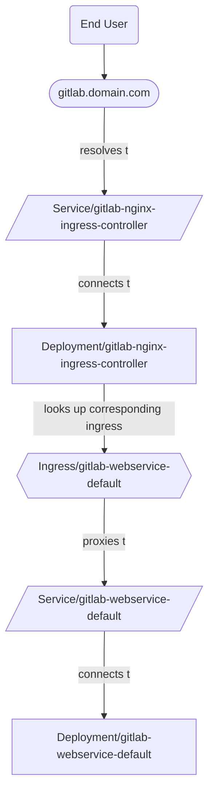
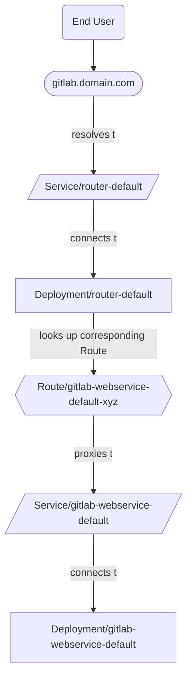

# Ingress in OpenShift

Two supported methods exist for providing Ingress in OpenShift with the GitLab Operator:

1. (Default) [NGINX Ingress Controller](#nginx-ingress-controller)
1. [OpenShift Routes](#openshift-routes)

## NGINX Ingress Controller

In this configuration, traffic flows as follows:



### Workaround for OpenShift Router overriding NGINX Ingress Controller

In an OpenShift environment, the GitLab Ingresses may receive the hostname of
the GitLab instance instead of the external IP address of the NGINX Service.
This can be seen in the output of `kubectl get ingress -n <namespace>` in the
`ADDRESS` column.

The OpenShift Router controller incorrectly updates the Ingress resource
instead of ignoring it due to the different Ingress class. The following
command instructs the OpenShift Router controller to properly ignore
Ingresses other than the standard Ingresses deployed in OpenShift:

```shell
  kubectl -n openshift-ingress-operator \
    patch ingresscontroller default \
    --type merge \
    -p '{"spec":{"namespaceSelector":{"matchLabels":{"openshift.io/cluster-monitoring":"true"}}}}'
```

If this patch is applied after Ingresses have already been created, manually delete
the Ingresses. The GitLab Operator manually recreates them. They should be
properly owned by the NGINX Ingress Controller and ignored by the OpenShift Router.

NOTE:
A bug can occur when manually deleting Ingresses.
The workaround is to manually delete the GitLab Operator controller Pod. Refer to
[#315](https://gitlab.com/gitlab-org/cloud-native/gitlab-operator/-/issues/315)
for more information.

### Configuration

By default, the GitLab Operator deploys the GitLab
[fork of the NGINX Ingress Controller chart](https://docs.gitlab.com/charts/charts/nginx/fork.html).

To use the NGINX Ingress Controller for Ingress, complete the following:

1. Start by following the first step of the [installation instructions](installation.md) to install the GitLab Operator.
1. Find the domain name associated with the Route created for Webservice:

   ```plaintext
   $ kubectl get route -n openshift-console console -ojsonpath='{.status.ingress[0].host}'

   console-openshift-console.yourdomain.com
   ```

   The domain to use in the next step is the portion _after_ `console-openshift-console`.

1. In the step where the GitLab CR manifest is created, set the domain as follows:

   ```yaml
   spec:
     chart:
       values:
         global:
           # Configure the domain from the previous step.
           hosts:
             domain: yourdomain.com
   ```

   NOTE:
   By default, CertManager creates and manages TLS certificates for the GitLab-related Ingresses.
   See the [TLS documentation](https://docs.gitlab.com/charts/installation/tls.html) for more options.

1. Follow the rest of the installation instructions, applying the GitLab CR and confirming that the CR status is eventually `Ready`.
1. Find the external IP address of the NGINX Ingress Controller's Service (of type LoadBalancer):

   ```plaintext
   $ kubectl get svc -n gitlab-system gitlab-nginx-ingress-controller -ojsonpath='{.status.loadBalancer.ingress[].ip}'

   11.22.33.444
   ```

1. Create A records in your DNS provider to connect the domain and the external IP address from the previous steps:

   - `gitlab.yourdomain.com` -> `11.22.33.444`
   - `registry.yourdomain.com` -> `11.22.33.444`
   - `minio.yourdomain.com` -> `11.22.33.444`

   Creating individual A records rather than a wildcard A record ensures that existing Routes (such as the Route for the OpenShift
   dashboard) continue to work as expected.

GitLab should then be available at `https://gitlab.yourdomain.com`.

## OpenShift Routes

By default, OpenShift uses
[Routes](https://docs.openshift.com/container-platform/4.10/networking/routes/route-configuration.html)
to manage Ingress.

In this configuration, traffic flows as follows:



NOTE:
Using Routes for Ingress instead of the NGINX Ingress Controller means that [Git over SSH](git_over_ssh.md)
is not supported.

### Setup

To use OpenShift Routes for Ingress, complete the following:

1. Start by following the first step of the [installation instructions](installation.md) to install the GitLab Operator.
1. Find the domain name associated with the Route created for Webservice:

   ```plaintext
   $ kubectl get route -n openshift-console console -ojsonpath='{.status.ingress[0].host}'
   console-openshift-console.yourdomain.com
   ```

   The domain to use in the next step is the portion _after_ `console-openshift-console`.
1. In the step where the GitLab CR manifest is created, also set:

   ```yaml
   spec:
     chart:
       values:
         # Disable NGINX Ingress Controller.
         nginx-ingress:
           enabled: false
         global:
           # Configure the domain from the previous step.
           hosts:
             domain: yourdomain.com
           ingress:
             # Unset `spec.ingressClassName` on the Ingress objects
             # so the OpenShift Router takes ownership.
             class: none
             annotations:
               # The OpenShift documentation says "edge" is the default, but
               # the TLS configuration is only passed to the Route if this annotation
               # is manually set.
               route.openshift.io/termination: "edge"
   ```

   NOTE:
   By default, CertManager will create and manage TLS certificates for the GitLab-related Routes.
   See the [TLS documentation](https://docs.gitlab.com/charts/installation/tls.html) for more options.
   If the OpenShift cluster is secured with a wildcard certificate,
   [option 2](https://docs.gitlab.com/charts/installation/tls.html#option-2-use-your-own-wildcard-certificate)
   allows the wildcard certificate to secure the GitLab-related Routes.

1. Follow the rest of the installation instructions, applying the GitLab CR and confirming that the CR status is eventually `Ready`.

GitLab should then be available at `https://gitlab.yourdomain.com`.

In this configuration, OpenShift Routes are created by translating the Ingresses created by the GitLab Operator.
More information on this translation is available in the
[Route documentation](https://docs.openshift.com/container-platform/4.9/networking/routes/route-configuration.html#nw-ingress-creating-a-route-via-an-ingress_route-configuration).
